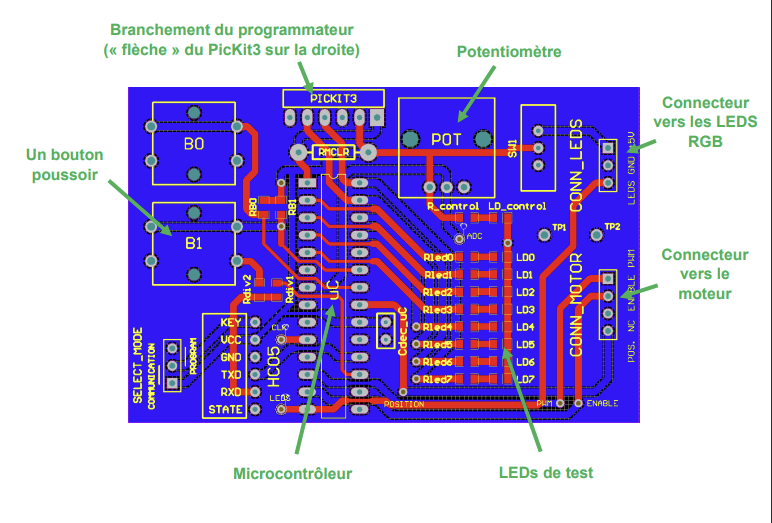

# Digital Electronics Projects in MPLAB Assembly Language

Welcome to the README for the collection of digital electronics projects developed in MPLAB Assembly language. This document provides an overview of various exercises and a project that I've completed, focusing on the principles of digital electronics, microcontroller programming, and system integration using assembly language.

## Table of Contents

1. [Introduction](#introduction)
2. [Prototyping Board Overview](#prototyping-board-overview)
3. [Exercises](#exercises)
   - [Exercises on Simulator](#exercises-on-simulator)
   - [Exercises on Prototyping Board](#exercises-on-prototyping-board)
4. [Rotary LED Display Project](#rotary-led-display-project)
   - [Project Objectives](#project-objectives)
   - [Project Description](#project-description)
   - [Requirements Specification](#requirements-specification)
   - [Provided Material](#provided-material)
   - [Electrical Schematics](#electrical-schematics)
   - [PCB Layout](#pcb-layout)
   - [Methodology and Validation](#methodology-and-validation)
   - [Configuration Bits in PIC18F25K40](#configuration-bits-in-pic18f25k40)
   - [Example ADC Configuration in PIC18F25K40](#example-adc-configuration-in-pic18f25k40)
   - [Example PWM Signal Configuration in PIC18F25K40](#example-pwm-signal-configuration-in-pic18f25k40)
   - [Example UART Module Configuration in PIC18F25K40](#example-uart-module-configuration-in-pic18f25k40)
   - [Addressing RGB LEDs](#addressing-rgb-leds)
   - [Controlling the Motor](#controlling-the-motor)

---

### Introduction

This project aims to apply theoretical knowledge in digital electronics to practical experiments and project development. It covers various exercises ranging from basic operations like counters and loops to advanced functionalities like PWM signal generation, UART communication, and the use of ADCs.

### Prototyping Board Overview

The projects utilize a microcontroller from MICROCHIP, specifically the PIC18F25K40, to demonstrate digital signal processing, input/output handling, and peripheral configuration.

### Exercises

#### Exercises on Simulator

- **Counters, loops, data manipulation:** Introduction to basic programming structures.
- **Subroutine Calls:** Understanding the call and return instructions.
- **Arrays and Memory Management:** Techniques for handling data in RAM and Flash memory.

#### Exercises on Prototyping Board

- **I/O Ports Usage:** Configuring and using microcontroller I/O pins.
- **Software Timing Routines:** Implementing delays using software loops.
- **Hardware Timing Routines:** Utilizing timers for precise delay generation.
- **Interrupts Handling:** Configuring and using microcontroller interrupts.
- **Analog-to-Digital Conversion:** Reading analog signals and processing them digitally.
- **PWM Signal Generation:** Controlling devices with pulse-width modulation.
- **Servo Motor Control:** Precision control of servo motors.
- **UART Communication:** Implementing serial communication for data exchange.

### Rotary LED Display Project

#### Project Objectives

Develop a command circuit for a rotary LED display, showcasing digital design skills from signal acquisition to actuator control based on processed information. The project emphasizes integrating a microcontroller, RGB LEDs, a motor, input devices, and potentially a Bluetooth module for wireless interaction.

#### Requirements Specification

The complete control circuit operates at 5V, with strict adherence to this voltage to protect sensitive components. It incorporates a PIC18F25K40 microcontroller, programmable in assembly language. The project requires careful consideration of memory register locations and the implementation of a serial communication protocol for LED control. The motor's speed is controlled via PWM, with specific requirements for the PWM frequency and duty cycle.

#### Provided Material

The project kit includes a microcontroller, input buttons, a potentiometer, LEDs, resistors, capacitors, and optional Bluetooth module components for expanded functionality.

### Methodology and Validation

The project encourages a step-by-step development approach, starting with essential microcontroller functionalities and progressively integrating more complex systems. Validation is performed through demonstration and explanation, ensuring a comprehensive understanding of the system's operation.

### Configuration and Examples

The annexes provide examples and guidance for configuring the microcontroller's ADC, PWM, and UART modules, addressing RGB LEDs, and controlling the motor based on the PWM duty cycle.

# Nolan CACHEUX